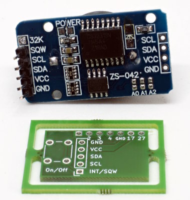
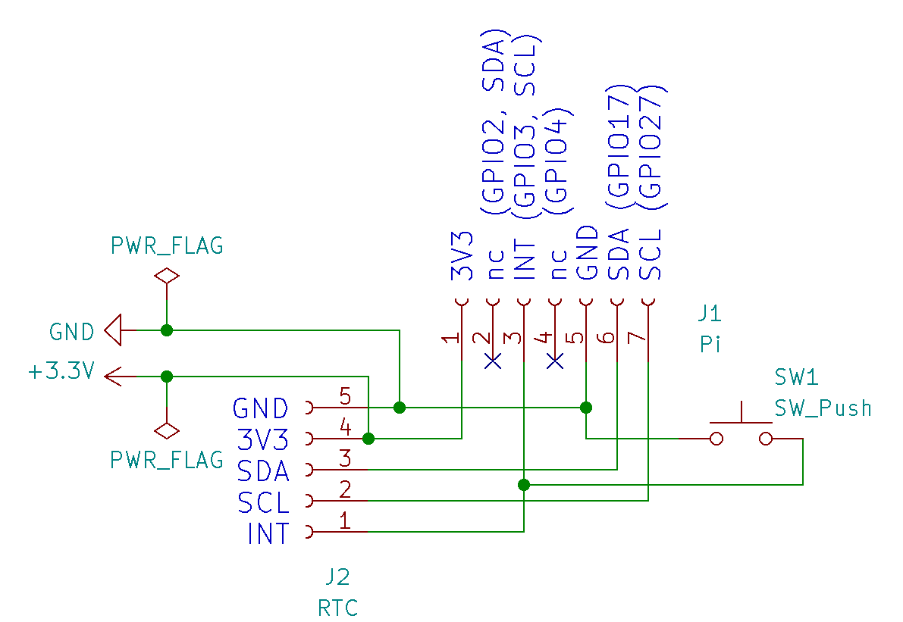

PCB-RTC-Breakout
================

This is a minimalistic pcb to add a normal DS3131-breakout to a
Raspberry Pi:

Note that you have to remove the 32K-pin of the breakout and that
you might have to bend the other pins.

The pcb also adds a connector for a button. With the correct
configuration of the Pi you can now start and stop the Pi cleanly
with the button and start it in addition with the alarm of the RTC.

Note that the normal I2C-bus in not available when the button is
populated and configured.

Schematic
---------

The pcb just connects the I2C-lines of the RTC-breakout to GPIO17 and
GPIO27. Normal I2C is not available, since GPIO3 is needed for the
shutdown/restart function.

PCB-production
--------------

The pcb-definition (Kicad-format) is in the directory `rtc-breakout.kicad`.
If your favorite pcb-factory does not support Kicad directly, you can
export to Gerber from within Kicad.

Configuration
-------------

In `/boot/config.txt`, add the following lines:

    dtoverlay=i2c-rtc-gpio,ds3231,i2c_gpio_sda=17,i2c_gpio_scl=27,wakeup-source
    dtoverlay=gpio-shutdown

The first line configures the RTC, the second line configures the button
to initiate a shutdown. If you do not cut power, a second press of the
button will restart the Pi.

License
-------

Shield: [![CC BY-SA 4.0][cc-by-sa-shield]][cc-by-sa]

This work is licensed under a
[Creative Commons Attribution-ShareAlike 4.0 International
License][cc-by-sa].

[![CC BY-SA 4.0][cc-by-sa-image]][cc-by-sa]

[cc-by-sa]: http://creativecommons.org/licenses/by-sa/4.0/
[cc-by-sa-image]: https://licensebuttons.net/l/by-sa/4.0/88x31.png
[cc-by-sa-shield]:
https://img.shields.io/badge/License-CC%20BY--SA%204.0-lightgrey.svg
